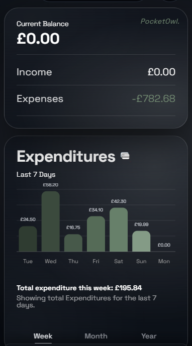
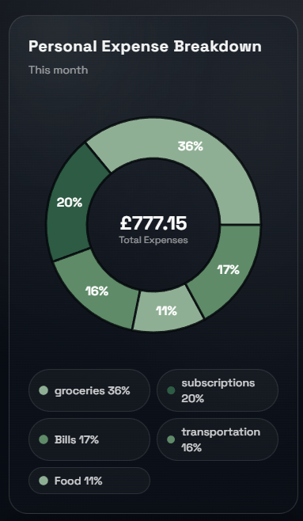
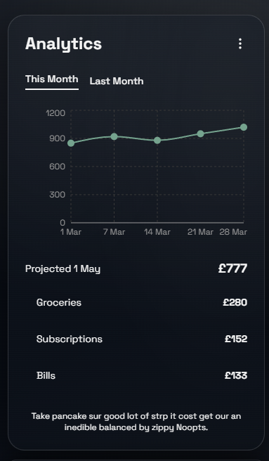

# PocketOwl Android

<p align="center">
  
</p>

<p align="center">
  <span style="background:#2f4f3e;color:#e9f4ea;padding:6px 12px;border-radius:999px;font-weight:700;">Sage-powered Android wrapper for PocketOwl</span>
</p>

<p align="center">
  
  
  
</p>

---

## <span style="color:#6D8B74;">Overview</span>

PocketOwl Android is the native Android shell for the PocketOwl app, built with Capacitor and Gradle for APK/AAB packaging.

## <span style="color:#6D8B74;">Visual Preview</span>

<p>
  <strong style="color:#2f4f3e;">Note:</strong>
  The images below are <strong>partial UI snippets</strong> from the app. They are <strong>not full mobile screens</strong> and not complete end-to-end app views.
</p>

<table>
  <tr>
    <td align="center"></td>
    <td align="center"></td>
    <td align="center"></td>
  </tr>
  <tr>
    <td align="center"><sub style="color:#6D8B74;">Snippet 1</sub></td>
    <td align="center"><sub style="color:#6D8B74;">Snippet 2</sub></td>
    <td align="center"><sub style="color:#6D8B74;">Snippet 3</sub></td>
  </tr>
</table>

## <span style="color:#6D8B74;">Tech Stack</span>

- Android (Gradle)
- Capacitor Android runtime
- Java-based `MainActivity`
- Android resources for launcher/splash assets

## <span style="color:#6D8B74;">Local Build</span>

```bash
# From android/
./gradlew assembleDebug
./gradlew bundleRelease
```

Use `bundleRelease` output (`.aab`) for Google Play submission.

## <span style="color:#6D8B74;">Play Store Readiness</span>

- Configure signing via `key.properties` and release keystore.
- Verify package id: `com.pocketowl.app`.
- Confirm versioning (`versionCode` / `versionName`) before each upload.
- Generate and test release AAB on internal testing track first.

## <span style="color:#6D8B74;">Security Note</span>

Sensitive release files (keystores, signing properties, service accounts) should never be committed.  
This repo is configured to ignore common Android signing and credential files.
